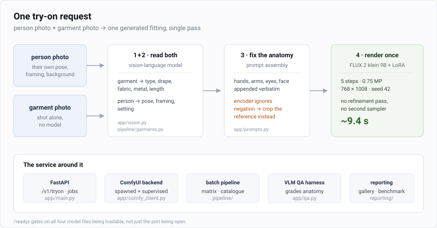
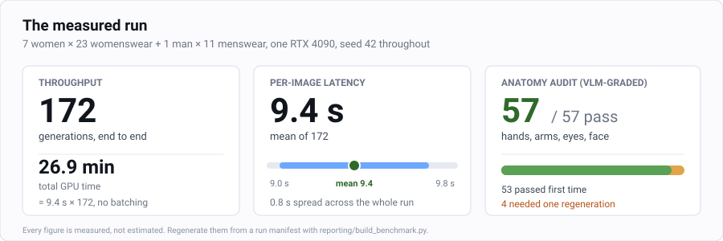

# Virtual Try-On

Put a photo of a person and a photo of a garment in; get a photograph of that
person wearing that garment out. No garment masks, no pose keypoints, no
per-outfit training, no manual retouching.

A **FastAPI** service wrapping **FLUX.2 klein 9B + fal's virtual-try-on LoRA** on a
ComfyUI backend, plus the batch pipeline, the vision-model garment cataloguer and
the QA harness used to run and grade it at scale.

```
   person photo            garment photo                 generated result
  ┌──────────────┐        ┌──────────────┐              ┌──────────────┐
  │  their own   │        │   garment    │              │ same person, │
  │ pose, frame, │   +    │  shot alone, │      ==>     │ same framing │
  │  background  │        │  no model    │              │  new outfit  │
  └──────────────┘        └──────────────┘              └──────────────┘
        │                        │                             ▲
        └─ read for pose,        └─ read for type, drape,       │
           framing, setting         fabric, metal, length    one pass,
                                                             ~9 s
```

The subject keeps their face, pose, framing and background; the garment keeps
its embroidery, drape and colourway.



> **No imagery of people is published in this repository, by design.** The
> original benchmark ran against photographs of real people and those are not
> redistributed. Nor are example outputs faked to fill the gap: every figure and
> diagram here is either measured or schematic, and clearly one or the other.
>
> To produce a visual gallery, point the pipeline at subjects of your own and run
> **`make showcase`** — it catalogues, generates and builds a browsable page in
> one command. That is the only step in this repository that needs a GPU.

---

## Results

A full run of every model against every garment in their set — 7 women × 23
womenswear, 1 man × 11 menswear:

| | |
|---|---|
| Generations | **172** |
| Sampling | 5 steps · 0.75 MP (768 × 1008) |
| Seed | **42 for all 172** — two results differ only by their inputs, never by chance |
| Render time | mean **9.4 s** · range 9.0–9.8 s |
| Total GPU time | **26.9 min** on a single RTX 4090 |
| Anatomy audit | 57 images graded by a VLM — **57 pass**, 4 needed one regeneration |



Rebuild these numbers yourself with `reporting/build_benchmark.py`, which reads
the run manifest rather than any hand-typed figure.

---

## How it works

1. **Read the garment.** A vision-language model looks at the flat garment photo
   and writes out its structure — type, piece count, drape, fabric, metal,
   length, how each layer sits. See `app/vision.py` and `pipeline/garments.py`.
2. **Read the person.** The same pass reads the person's photo for pose, framing
   and setting. This is what keeps the subject in their own room or street
   instead of teleporting them into the garment photo's showroom
   (`app/person_prompt.py`).
3. **Constrain the anatomy.** Hands, arms, eyes, face and accessory constraints
   are appended verbatim to every prompt. The text encoder ignores negation, so
   anything that must be *absent* is handled by cropping the garment reference
   rather than by asking for its absence (`app/tryon_prompt.py`).
4. **Render once, then grade.** One pass through the graph in
   `workflows/tryon_api.json`; `app/guardrail.py` and `app/qa.py` run a resident
   vision model over the result and reject anything with broken anatomy.

---

## Quick start

Full instructions, hardware guidance and troubleshooting: **[docs/SETUP.md](docs/SETUP.md)**.

```bash
make env                 # create .env, then set API_KEYS
make install             # ComfyUI + custom node + python deps  (~5 min)
make models              # download and verify ~19 GB of weights (~15 min)
make serve               # http://0.0.0.0:8000  — docs at /docs
make smoke               # end-to-end check
```

Docker:

```bash
cp .env.example .env     # set API_KEYS
make docker-build
make docker-models       # populates the models volume, once
make docker-up
```

---

## Hardware

Weights total ~19 GB on disk, but ComfyUI streams modules, so peak VRAM is
about **10–12 GB**.

| GPU | Works | Notes |
|---|---|---|
| T4 16 GB | yes | set `COMFY_EXTRA_ARGS=--lowvram`; slow |
| **L4 24 GB** (`g6.2xlarge`) | **yes** | good value; no `--lowvram` needed |
| L40S 48 GB (`g6e.2xlarge`) | yes | fastest per-image; raise `WORKERS` |
| A100 / H100 | yes | overkill for 9B |

---

## API

All endpoints except `/healthz`, `/readyz` and `/v1/prompts` require an
`X-API-Key` header when `API_KEYS` is set. **An empty `API_KEYS` disables auth
entirely** — never ship that.

### `POST /v1/tryon`

`multipart/form-data`:

| field | type | default | notes |
|---|---|---|---|
| `person` | file | required | photo of the person |
| `garment` | file | required | photo of the garment |
| `prompt` | string | – | free text; wins over `preset` |
| `preset` | string | – | id from `GET /v1/prompts` |
| `steps` | int | 8 | 1–50 |
| `cfg` | float | 1.0 | 1.0–10.0 |
| `seed` | int | random | pin it to compare runs |
| `lora_strength` | float | 0.4 | 0.0–2.0 |
| `megapixels` | float | 1.0 | 0.25–4.0 |
| `swap_slots` | bool | false | see *Known ambiguity* |

Query param `?wait=true` blocks until the job finishes instead of returning a
job id. Convenient for testing; do not use it behind a proxy with a short
timeout.

```bash
curl -X POST http://localhost:8000/v1/tryon \
  -H "X-API-Key: $KEY" \
  -F "person=@model.jpg" \
  -F "garment=@saree.jpg" \
  -F "preset=f4_saree" \
  -F "steps=12" -F "seed=42"
# -> {"job_id":"…","status":"queued","poll_url":"/v1/jobs/…"}
```

### `GET /v1/jobs/{job_id}`

```json
{"job_id":"…","status":"running","progress":0.5,"step":4,"total_steps":8,
 "seed":42,"duration_seconds":null,"image_url":null,"error":null}
```

### `GET /v1/jobs/{job_id}/image`

PNG bytes once `status` is `succeeded`. `409` while still running, `422` if the
job failed.

### `GET /v1/prompts`

Preset prompts, including one per preset outfit (`f1_orange` … `f5_pink_suit`,
`m1_studded_tee` … `m5_field_jacket`).

### `GET /healthz` · `GET /readyz`

`/healthz` always returns 200 with detail. `/readyz` returns **503** unless
ComfyUI is reachable *and* all four model files are actually loadable — it
queries ComfyUI's `/object_info` rather than just checking the port. Use
`/readyz` for your load balancer.

---

## What changed from the notebook

The Colab notebook worked as a demo but had defects that mattered for serving:

**Fixed**

- **Silent failures.** Setup ran `subprocess.run(..., capture_output=True)`
  without checking return codes, and launched ComfyUI with stdout/stderr to
  `DEVNULL`. A 404 on a weight download looked exactly like success. Both
  install scripts now fail loudly, and ComfyUI's output is piped into the
  service logger.
- **`Flux2Scheduler` resolution bug.** Node 152 read `["157", 1]` — the height
  output — for *both* width and height. Node 156 got it right, so this was a
  copy-paste slip. It skews the scheduler's shift on non-square inputs, which
  is every image in this project. Now `["157", 0]` for width.
- **Third-party workflow dependency.** The JSON was fetched at runtime from a
  *patch branch* of someone's GitHub repo. Vendored to `workflows/tryon_api.json`.
- **Model name mismatch.** The JSON asked for `Flux-2-Klein-9B-KV-Q5_K_S.gguf`
  while the notebook downloaded `flux-2-klein-9b-Q8_0.gguf`, papered over by a
  runtime patch. Filenames now come from config, one source of truth.
- **No reproducibility.** Seed, steps, CFG and LoRA strength were buried in the
  workflow JSON with nothing exposed. All are per-request parameters now — you
  cannot A/B garment fidelity without pinning a seed.
- **Public tunnel.** `share=True` opened a world-readable Gradio URL. Replaced
  with API-key auth and configurable CORS.
- **Four custom node packs reduced to one.** rgthree, LayerStyle and Comfyroll
  existed only for debug preview nodes and a comparison strip that needed a
  font file which may not be present. Stripped; `ComfyUI-GGUF` remains.

**Tuning changes**

- Default steps **4 → 8**. Four steps is a turbo setting; dense embroidery and
  fine metallic thread need more. Try 12–16 when garment fidelity matters more
  than latency.
- `cfg` is exposed but stays at 1.0. The graph builds a negative-conditioning
  branch (nodes 167/160/166) that has **no effect at cfg 1.0**. Raise cfg above
  1.0 to make it live — worth an experiment, but it costs a second model pass
  per step.

---

## Prompting

The upstream workflow shipped with a Chinese instruction:

> `将图1的女性模特服装换成图2`
> *(replace the clothing of the female model in image 1 with image 2)*

That is a strong hint the fal LoRA was trained on Chinese instruction pairs, so
it is the default when you send no `prompt` or `preset`. **A/B it against your
English prompt** — do not assume either wins.

The English presets in `app/prompts.py` are the detailed per-garment prompts,
which name exact embroidery colours and motifs. Generic prompts are how you get
paraphrased embroidery, which is the failure that matters commercially: the
customer is buying that specific SKU.

---

## Known ambiguity: which slot is the person?

The upstream graph is genuinely inconsistent about this and it is worth
resolving empirically on your own images.

- Node `157 GetImageSize` drives the output canvas. Upstream it read the `278`
  branch, but the notebook patched it at runtime to read the `270` branch —
  implying `270` is the person, since the output should match the person's
  framing. That patch is vendored here.
- But the `ReferenceLatent` chain feeds the `278` branch first, and the Chinese
  prompt says *image 1* is the model — which would make `278` the person.

The two signals disagree. `swap_slots=true` flips the assignment so you can run
both and keep whichever is right:

```bash
for s in false true; do
  curl -s -X POST "localhost:8000/v1/tryon?wait=true" -H "X-API-Key: $KEY" \
    -F person=@model.jpg -F garment=@saree.jpg \
    -F seed=42 -F swap_slots=$s | jq -r .job_id
done
```

Same seed, both directions, compare. Fix the default in `.env` once you know.

---

## Repo layout

```
app/                      the HTTP service
  main.py                 FastAPI routes, ComfyUI supervision, lifespan
  comfy_client.py         async HTTP + websocket client for ComfyUI
  jobs.py                 in-process queue and worker
  workflow.py             graph construction; node map documented at the top
  vision.py               VLM garment/person reader
  garment.py garment_bg.py  garment isolation and background handling
  tryon_prompt.py person_prompt.py prompts.py   prompt construction + presets
  guardrail.py qa.py      resident vision model that grades every result
  batch.py library.py brochure.py   bulk generation and catalogue output
  auth.py config.py schemas.py lifecycle.py

pipeline/                 batch runs and evaluation
  garments.py             hand-written garment specs (beat the VLM catalogue)
  run_matrix.py           every model × every garment
  run_catalogue.py run_pair.py run_guarded.py qa_sweep.py
  eval_vlm/               build, run and report the VLM evaluation set

reporting/
  build_gallery.py        contact sheets from a run
  build_benchmark.py      the benchmark tables and report

workflows/tryon_api.json  vendored, cleaned ComfyUI graph (25 nodes)
web/index.html            minimal browser client for the API

scripts/
  install.sh              ComfyUI + ComfyUI-GGUF + deps
  download_models.sh      weights, with size verification
  build_showcase.sh       subjects -> catalogue -> matrix -> gallery (needs a GPU)
  hash_password.py make_notebook.py

deploy/                   provisioning, sync and tunnel helpers for a GPU box
notebooks/                Colab starting point
tests/
  smoke_test.py           end-to-end check
  run_suite.py test_catalogue.py

docs/
  SETUP.md                install, configure, run, troubleshoot
  ARCHITECTURE.md         production architecture notes
  assets/                 the pipeline diagram and the measured-run chart
gallery-tools/            builds a browsable gallery from a run you generate
```

---

## Operational notes

- **`WORKERS=1`** by default. ComfyUI serialises on the GPU; more workers only
  helps on a 48 GB card where two model copies fit.
- **Jobs are in-memory** and expire after `JOB_TTL_SECONDS` (1 h). Results are
  not persisted — if you need durable output, write to S3 in
  `JobManager._worker` after `client.run` returns.
- **Restarting drops queued jobs.** For a single GPU box that is usually fine;
  if it is not, put Redis or a real queue in front.
- **First request after boot is slow** — ComfyUI loads ~19 GB lazily. The
  Docker healthcheck allows a 300 s start period for this.


---

## Licence and model terms

The code in this repository is yours to read and adapt. The **models are not
covered by it**:

- **FLUX.2 klein 9B — Apache-2.0**, and the fal virtual-try-on LoRA likewise. That
  is why this stack was chosen: it is commercially deployable.
- **FLUX.2 `[dev]` is not.** Its licence forbids serving the model in a paid
  product. Do not swap it in without reading the terms.

## A note on the imagery

This repository ships **no photographs of people**. The 172-generation benchmark
quoted above was run against photographs of real individuals; those images and
the results derived from them are deliberately not published here. Point the
pipeline at your own inputs, or at synthetic subjects, to reproduce the numbers:
`make showcase` runs the whole chain and writes a browsable gallery of results
you generated yourself. No example output in this repository is fabricated to
stand in for one.
